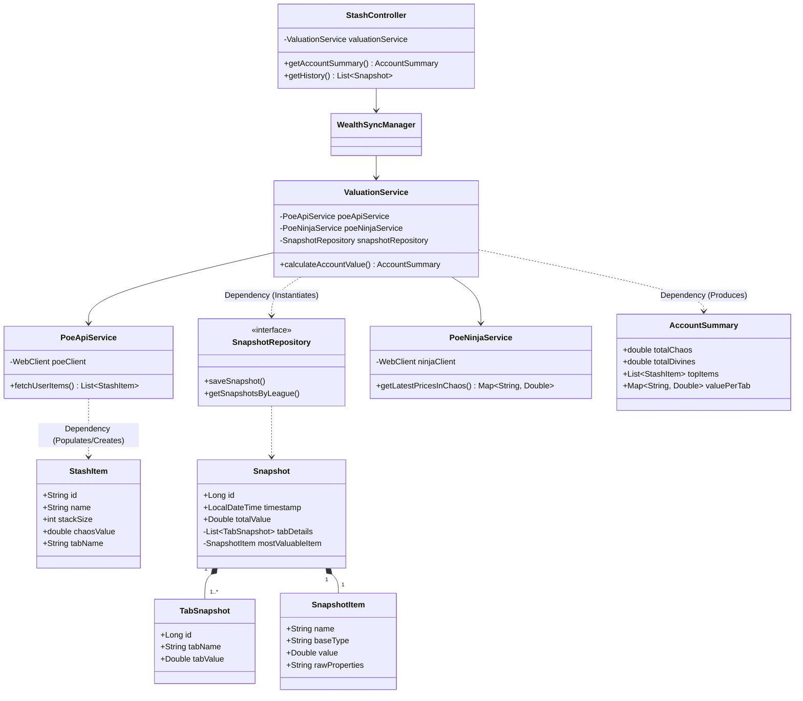

```mermaid

classDiagram
    direction TB
    
    class StashController {
        -ValuationService valuationService
        +getAccountSummary() AccountSummary
        +getHistory() List~Snapshot~
    }

    class WealthSyncManager {

    }

    class ValuationService {
        -PoeApiService poeApiService
        -PoeNinjaService poeNinjaService
        -SnapshotRepository snapshotRepository
        +calculateAccountValue() AccountSummary
    }

    class SnapshotRepository {
        <<interface>>
        +saveSnapshot()
        +getSnapshotsByLeague()
    }

    class PoeApiService {
        -WebClient poeClient
        +fetchUserItems() List~StashItem~
    }

    class PoeNinjaService {
        -WebClient ninjaClient
        +getLatestPricesInChaos() Map~String, Double~
    }

    class StashItem {
        +String id
        +String name
        +int stackSize
        +double chaosValue
        +String tabName
    }

    class AccountSummary {
        +double totalChaos
        +double totalDivines
        +List~StashItem~ topItems
        +Map~String, Double~ valuePerTab
    }

    class Snapshot {
        +Long id
        +LocalDateTime timestamp
        +Double totalValue
        -List~TabSnapshot~ tabDetails
        -SnapshotItem mostValuableItem
    }

    class TabSnapshot {
        +Long id
        +String tabName
        +Double tabValue
    }

    class SnapshotItem {
        +String name
        +String baseType
        +Double value
        +String rawProperties
    }

    %% Relationships
    StashController --> WealthSyncManager
    WealthSyncManager --> ValuationService
    ValuationService --> PoeApiService
    ValuationService --> PoeNinjaService
    
    %% Fixed Dependencies (Dotted)
    PoeApiService ..> StashItem : Dependency (Populates/Creates)
    ValuationService ..> AccountSummary : Dependency (Produces)
    
    %% Persistence Logic
    Snapshot "1" *-- "1..*" TabSnapshot
    Snapshot "1" *-- "1" SnapshotItem
    ValuationService ..> SnapshotRepository : Dependency (Instantiates)
    SnapshotRepository ..> Snapshot

```