```mermaid

classDiagram
    direction TB
    
    class StashController {
        -WealthSyncManager wealthSyncManager
        -ValuationService valuationService
        +getStashSummary(String league) StashSummary
        +saveStashSnapshot(String league)
        +getStashHistory(String league) List~StashSnapshot~
    }

    class CharacterController {
        -WealthSyncManager wealthSyncManager
        -ValuationService valuationService
        +getCharacterSummary(String league, String charName) CharacterSummary
        +saveCharacterSnapshot(String league, String charName)
        +getCharacterHistory(String league) List~CharacterSnapshot~
    }

    class WealthSyncManager {
        +allowRequest() boolean
    }
 
    class ValuationService {
        -PoeApiService poeApiService
        -PoeNinjaApiService poeNinjaService
        -PoeTradeApiService poeTradeApiService
        -StashSnapshotRepository stashSnapshotRepository
        -CharacterSnapshotRepository characterSnapshotRepository
        +calculateStashValue(String league) StashSummary
        +captureStash(String league)
        +buildStashHistory(String league) List~StashSnapshot~
        +calculateCharacterValue(String league, String charName) CharacterSummary
        +captureCharacter(String league, String charName)
        +buildCharacterHistory(String league) List~CharacterSnapshot~
    }

    class SmartFilter {
        -List~String~ highVarianceUniques
        -List~String~ highValueBases
        +applyFilters(List~StashItem~ items)
    }

    class StashItem {
        +String id
        +String name
        +String tabName
        +int stackSize
        +boolean shouldDeepPrice
        +double chaosValue
    }

    class PoeApiService {
        -WebClient poeClient
        -SmartFilter smartFilter
        +fetchUserItems(String league) List~StashItem~
        +fetchUserCharacterNames(String league) List~String~
        +fetchUserCharacter(String league, String charName) Character
    }

    class Character {
        -Long id
        -String name
        -String league
        -Map~String, StashItem~ equippedItems
    }

    class PoeNinjaApiService {
        -WebClient ninjaClient
        -Map~String, Double~ priceCache
        +refreshPrices(String league) void
        +getDivineToChaosExchangeRate(String league) double
        +getQuickPrice(String itemName) double
    }

    class PoeTradeApiService {
        -WebClient tradeClient
        +priceItem(StashItem item) double
    }

    class StashSummary {
        <<DTO>>
        +double totalChaos
        +double totalDivines
        +List~StashItem~ topItems
        +Map~String, Double~ valuePerTab
    }

    class CharacterSummary {
        <<DTO>>
        +double totalChaos
        +double totalDivines
        +Map~String, StashItem~ equippedItems
    }

    class StashSnapshotRepository {
        <<interface>>
        +saveStashSnapshot(StashSnapshot stashSnap)
        +getStashSnapshotsByLeague(String league) List~StashSnapshot~
    }

    class StashSnapshot {
        +Long id
        +String league
        +LocalDateTime timestamp
        +Double divineChaosConversionRate
        +Double totalChaosValue
        -List~TabSnapshot~ tabDetails
        -SnapshotItem mostValuableItem
    }

    class TabSnapshot {
        +Long id
        +String tabName
        +Double tabValue
    }

    class CharacterSnapshotRepository {
        <<interface>>
        +saveCharacterSnapshot(CharacterSnapshot charSnap)
        +GetCharacterSnapshotsByLeague(String league) List~CharacterSnapshot~
    }

    class CharacterSnapshot {
        +Long id
        +String league
        +String characterName
        +LocalDateTime timestamp
        +Double divineChaosConversionRate
        +Double totalChaosValue
        -List~SnapshotItem~ equippedItems
    }

    class SnapshotItem {
        +Long id
        +String name
        +String baseType
        +Double chaosValue
        +String rawProperties
    }

    %% Relationships
    StashController --> WealthSyncManager
    CharacterController --> WealthSyncManager
    StashController --> ValuationService
    CharacterController --> ValuationService
    ValuationService --> PoeApiService
    ValuationService --> PoeNinjaApiService
    ValuationService --> PoeTradeApiService
    PoeApiService --> SmartFilter
    
    %% Fixed Dependencies (Dotted)
    PoeApiService ..> StashItem : Dependency (Populates/Creates)
    PoeApiService ..> Character : Dependency (Populates/Creates)
    ValuationService ..> StashSummary : Dependency (Produces)
    ValuationService ..> CharacterSummary : Dependency (Produces)
    
    %% Persistence Logic
    ValuationService ..> StashSnapshotRepository : Dependency (Instantiates)
    StashSnapshotRepository ..> StashSnapshot
    StashSnapshot "1" *-- "many" TabSnapshot
    StashSnapshot "1" *-- "1" SnapshotItem
    ValuationService ..> CharacterSnapshotRepository : Dependency (Instantiates)
    CharacterSnapshotRepository ..> CharacterSnapshot
    CharacterSnapshot "1" *-- "many" SnapshotItem

```

# System Architecture & Class Diagram
---
| Component | Responsibility | Detail |
| :--- | :--- | :--- |
| **StashController** | Entry Point for Stash requests. Exposes REST endpoints for the UI. | Spring RestController |
| **CharacterController** | Entry Point for Character. Exposes REST endpoints for the UI. | Spring RestController |
| **WealthSyncManager** | Traffic Control. Manages Rate Limits and scheduling. | `@Scheduled` & Caffeine Cache |
| **ValuationService** | The Brain. Orchestrates fetching and pricing logic. | Business Logic Layer |
| **SmartFilter** | Classifier. Identifies which items need deep pricing. | Predicate-based filtering |
| **PoeApiService** | Data Source. Communicates with GGG for items/chars. | WebFlux (Async WebClient) |
| **PoeNinjaApiService** | Fast Pricing. Bulk prices for currency and common items. | In-memory Map ($O(1)$) |
| **PoeTradeApiService** | Deep Pricing. Values Rares/Uniques via Official Trade API. | JSON Query Builder |
| **Snapshots** | Persistence. Stores historical wealth data by League. | Spring Data JPA + PostgreSQL |

---

