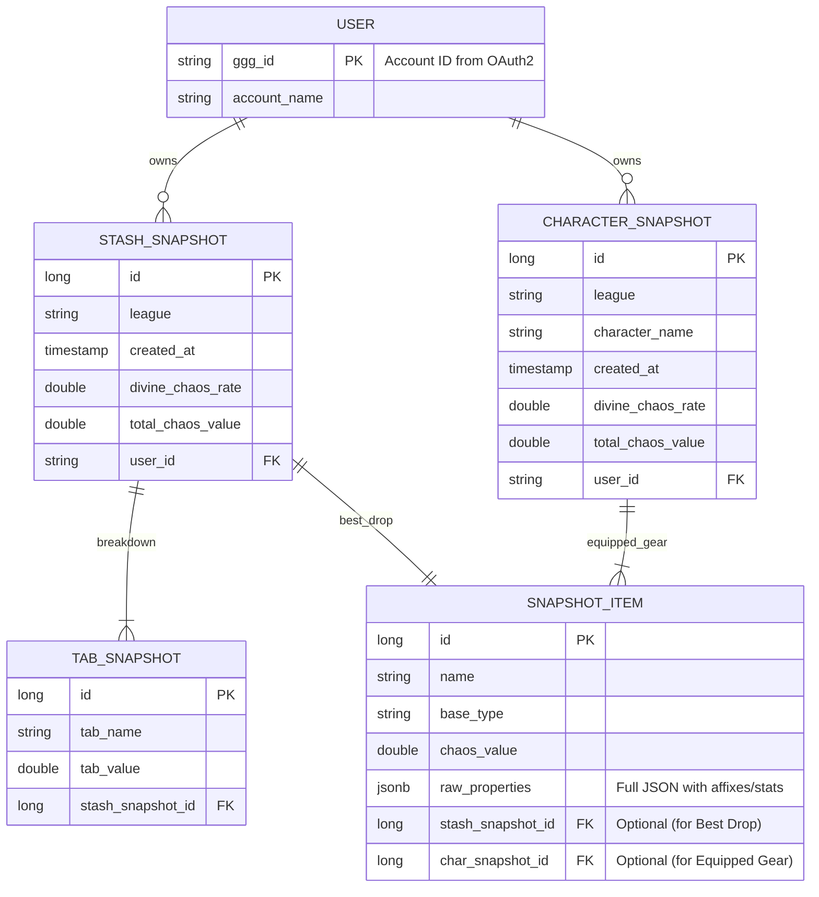

# Database Schema (ERD)

---

```mermaid

erDiagram
    USER ||--o{ STASH_SNAPSHOT : "owns"
    USER ||--o{ CHARACTER_SNAPSHOT : "owns"
    
    STASH_SNAPSHOT ||--|{ TAB_SNAPSHOT : "breakdown"
    STASH_SNAPSHOT ||--|| SNAPSHOT_ITEM : "best_drop"
    
    CHARACTER_SNAPSHOT ||--|{ SNAPSHOT_ITEM : "equipped_gear"

    USER {
        string ggg_id PK "Account ID from OAuth2"
        string account_name
    }

    STASH_SNAPSHOT {
        long id PK
        string league
        timestamp created_at
        double divine_chaos_rate
        double total_chaos_value
        string user_id FK
    }

    CHARACTER_SNAPSHOT {
        long id PK
        string league
        string character_name
        timestamp created_at
        double divine_chaos_rate
        double total_chaos_value
        string user_id FK
    }

    TAB_SNAPSHOT {
        long id PK
        string tab_name
        double tab_value
        long stash_snapshot_id FK
    }

    SNAPSHOT_ITEM {
        long id PK
        string name
        string base_type
        double chaos_value
        jsonb raw_properties "Full JSON with affixes/stats"
        long stash_snapshot_id FK "Optional (for Best Drop)"
        long char_snapshot_id FK "Optional (for Equipped Gear)"
    }

```